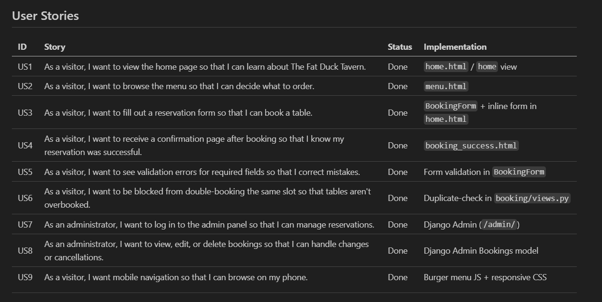

# The Fat Duck Tavern — Restaurant Booking System

Welcome to *The Fat Duck Tavern*, a full-stack web application designed to provide users with a seamless online table booking experience. This project was developed as part of a full-stack development course and showcases modern web development best practices, including responsive frontend design, a robust backend API, secure authentication, and cloud deployment.

---

## Project Overview

The Fat Duck Tavern app allows visitors to:

- View restaurant information, including the menu and contact details
- Book tables online by submitting a reservation form with validation to prevent duplicate bookings
- Receive a confirmation page summarizing their booking details

Administrators can manage bookings securely through the Django admin interface.

The system is built with Django on the backend and standard HTML/CSS on the frontend, focusing on clean UX, accessibility, and maintainability.

---

## User Stories

| ID  | Story | Status | Implementation |
|-----|-------|--------|----------------|
| US1 | As a visitor, I want to view the home page so that I can learn about The Fat Duck Tavern. | Done | `home.html` / `home` view |
| US2 | As a visitor, I want to browse the menu so that I can decide what to order. | Done | `menu.html` |
| US3 | As a visitor, I want to fill out a reservation form so that I can book a table. | Done | `BookingForm` + inline form in `home.html` |
| US4 | As a visitor, I want to receive a confirmation page after booking so that I know my reservation was successful. | Done | `booking_success.html` |
| US5 | As a visitor, I want to see validation errors for required fields so that I correct mistakes. | Done | Form validation in `BookingForm` |
| US6 | As a visitor, I want to be blocked from double-booking the same slot so that tables aren't overbooked. | Done | Duplicate-check in `booking/views.py` |
| US7 | As an administrator, I want to log in to the admin panel so that I can manage reservations. | Done | Django Admin (`/admin/`) |
| US8 | As an administrator, I want to view, edit, or delete bookings so that I can handle changes or cancellations. | Done | Django Admin Bookings model |
| US9 | As a visitor, I want mobile navigation so that I can browse on my phone. | Done | Burger menu JS + responsive CSS |

---

## Features

- **Responsive and Accessible UI:** Navigation adapts for mobile and desktop, forms include labels and client-side validation
- **Booking Form Validation:** Prevents duplicate bookings by the same email for the same date/time slot
- **Database-Backed:** All bookings are stored securely in a SQLite database with Django models
- **Role-Based Authentication:** Django's admin authentication controls access to administrative features
- **Static File Management:** Uses WhiteNoise for efficient serving of CSS and images in production
- **Cloud Deployment:** Hosted and deployed on Render.com, ensuring reliability and scalability

---

## User Experience

The site was designed with simplicity and usability in mind. Key pages include:

- **Home:** Welcoming landing page introducing The Fat Duck Tavern
- **Menu:** Displaying food and drink offerings
- **Booking:** A clear form where users can reserve tables
- **Confirmation:** A friendly confirmation page summarizing reservation details
- **Contact & About:** Providing restaurant contact info and background

The navigation menu remains consistent across pages, with a burger menu for smaller screens, ensuring smooth access anywhere.

---

## Installation and Running Locally

To run this project locally, ensure you have Python 3.10+ installed. Then:

```bash
git clone https://github.com/AndyLang81/the_fat_duck.git
cd the_fat_duck
python -m venv venv
source venv/bin/activate  # On Windows: venv\Scripts\activate
pip install -r requirements.txt
python manage.py migrate
python manage.py createsuperuser  # Create admin user
python manage.py collectstatic    # Prepare static files
python manage.py runserver
```

Visit `http://localhost:8000` to view the application.

---

## Deployment

1. Created a Web Service on Render.com linked to the `the_fat_duck` GitHub repo.  
2. Build Command: `pip install -r requirements.txt`  
3. Start Command: `gunicorn the_fat_duck.wsgi:application`  
4. Environment Variables:
   - `SECRET_KEY` set to your Django secret key  
   - `DEBUG` set to `False`  
5. Static files served via WhiteNoise; no additional configuration needed.

## Screenshots

### Agile Board (User Stories)


### Booking Flow
*[Screenshot placeholder]*

### Mobile Navigation
*[Screenshot placeholder]*

---

## Testing

Automated and manual tests have been conducted to ensure:

- Booking form validation works as expected
- Navigation links function correctly
- Access restrictions to admin pages are enforced
- Static files load properly in production

### Booking Form Manual Tests

#### Successful Booking
1. Go to `/book/`, fill in valid data, and submit
2. **Expected:** Redirect to confirmation page showing name, date, time, and guest count

#### Duplicate Booking Prevention
1. Revisit `/book/`, submit the same email/date/time as above
2. **Expected:** The form reloads with the error message "You already have a booking at that time."

#### Required Fields Validation
1. **Action:** Submit the booking form without filling in any fields
2. **Expected:** Each required field displays the error message "This field is required."

### JavaScript / UI Manual Tests

#### Mobile Navigation (Burger Menu)
1. Resize browser to mobile width or open on a phone
2. Click the burger icon
3. **Expected:** The nav menu expands and collapses

All tests were performed on Chrome and Django's development server.

---

## Technologies Used

- **Backend:** Python 3.13, Django 5.2
- **Frontend:** HTML5, CSS3, JavaScript (vanilla)
- **Database:** SQLite (development)
- **Deployment:** Render.com, Gunicorn, WhiteNoise

---

## Known Issues and Future Improvements

- Email notifications for bookings could be added
- Additional user roles and permissions could enhance administration
- More extensive frontend testing and improvements in accessibility
- Transition to PostgreSQL for production database scalability

---

## Author

This project was developed by Anders Langhoff as a portfolio piece demonstrating full-stack development skills, including project planning, database design, frontend and backend implementation, and deployment.

Thank you for reviewing The Fat Duck Tavern booking system. I welcome any feedback or questions.